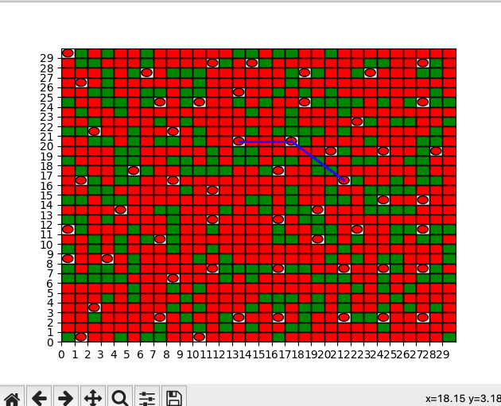
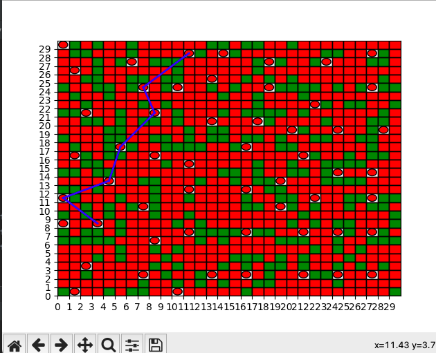
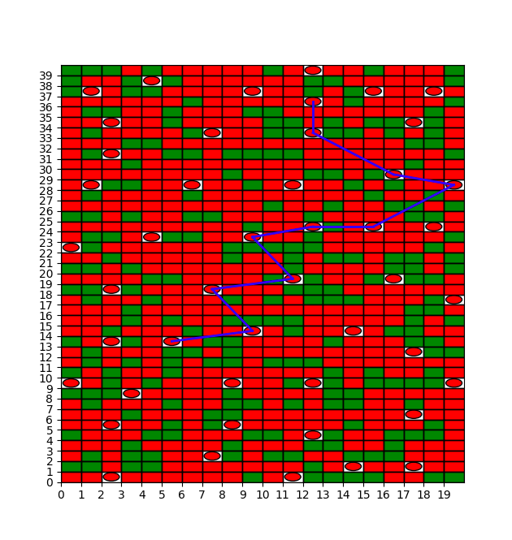
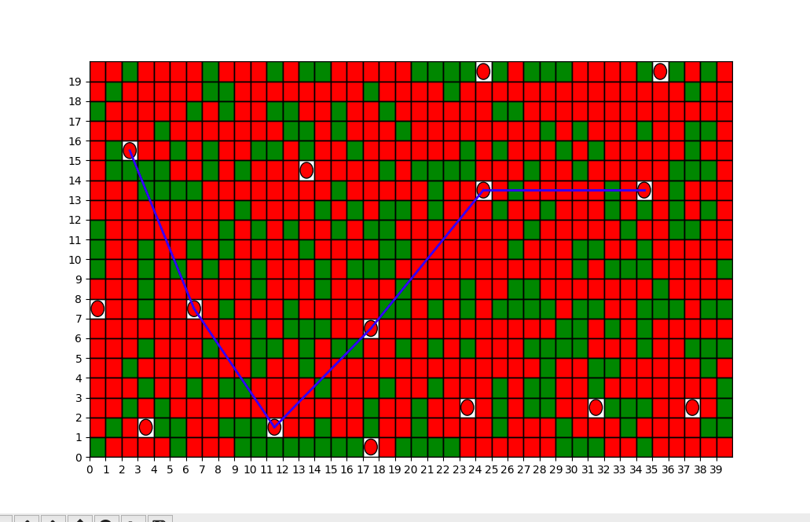

Task 4: Path Reliability
Imagine that data is transmitted between towers. For simplicity, assume that each tower can directly communicate with any other tower within its range.
Design an algorithm to find the most reliable path between two towers. The reliability of a path decreases with the number of hops (tower-to-tower links). So, a path with fewer hops is more reliable.

(в моем сценарии башни могут взаимодействовать, если их радиусы пересекаются хотя бы в одном блоке, я добавил это для лучшей визуализации, так как при изначальном сценарии в жадной оптимизации башни стоят удаленно друг от друга)

(30, 30, 30, range_r=2)

(20, 40, 30, range_r=2)

(40, 20, 30, range_r=5)

- Extend the optimization problem: Now towers have a cost, and you have a limited budget. Modify your algorithm to maximize coverage while staying within the budget.

Алгоритм не претерпит изменений, единственное что будет ограничение на количество вышек, связанное с бюджетом, но оптимальность будет также достигаться жадной стратегией

- Consider different types of towers with different ranges and costs. How would this change your optimization approach?

Тут также практически не будет изменений, единственное, что мы будем считать количество блоков и делить стоимость на это количество при поиске каждой вышки

По причине того, что изменения несущественные, я не стал тратить время на реализацию данных стратегий

## Описание Имплементации Алгоритма

Для решения задачи нахождения оптимального пути между башнями была применена жадная стратегия. Выбор данной стратегии обусловлен NP-полнотой задачи, что означает отсутствие эффективного алгоритма для её решения в общем случае. Поэтому, жадная стратегия является приемлемым компромиссом, позволяющим находить достаточно хорошее решение за приемлемое время.

Для удобства пользователя была добавлена интерактивная функция: при нажатии на две башни на экране автоматически вычерчивается путь, который выделен синим цветом. Это позволяет наглядно оценить предложенный алгоритмом маршрут между выбранными точками.

Визуализация элементов карты продумана для максимальной наглядности: башни представлены красными кружками, блоки – зелеными, а зоны действия каждой башни обозначены красными окружностями. Данное решение позволяет легко оценить как взаимное расположение башен, так и их потенциальное покрытие.

Было принято решение не учитывать блоки как препятствия для сигнала, так как в исходном задании не было указаний на и
